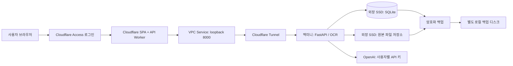

# 맥미니 기반 소규모 배포 계획

작성일: 2026-09-24

## 상태와 재시작 안내

2026-09-24 구현을 시작했다. 인증·사용자별 SQLite 저장·원본 파일·암호화된 개인 API 키·서버 검토 영속화·이관과 운영 템플릿을 추가했다. **외부 배포와 실제 유료 AI 호출은 하지 않았다.** 아래 구현 기록과 `deploy/README.md`를 함께 읽는다.

작업 도중 사용자가 배포 조건을 구체화했다: **M4 / 16GB 맥미니, 외장 2TB SSD, 프런트엔드는 Cloudflare 또는 Vercel, 보안과 운영자 단독 초대 계정 관리**. Docker는 검토 중이다. 기존 ‘맥미니에서 프런트까지 제공’ 설계는 Cloudflare 프런트 + 같은 출처 API 프록시 방식으로 변경했다. Docker는 실장비 검증 전 확정하지 않는다.

작업 트리에는 이전 기능 개발과 배포 구현이 함께 있다. 사용자가 GitHub Actions 연결을 요청했으므로 앱과 배포에 필요한 소스·설정을 게시 대상으로 준비한다. 별도의 기존 설계 문서 변경은 그대로 보존한다. 실제 서비스 설정은 Cloudflare 계정·SSD 경로·macOS 정보와 아래 통과 조건을 확보한 뒤 진행한다.

## 최신 변경: 맥미니 연동 전 미리보기와 과금 금지

사용자가 원격 작업 중이므로 맥미니 초기 설치를 보류한다. Cloudflare MCP OAuth 연결, GitHub-hosted CI, 별도 `resume-agent-preview` 정적 SPA를 먼저 준비한다. 브라우저 미리보기는 서버/AI/OCR 없이 텍스트 저장·편집·새로고침 복원을 제공하고 IndexedDB를 분리한다. 운영 배포와 혼동하지 않는다.

**백업 초과 과금 금지**에 따라 기존 R2 기본안을 폐기했다. 백업은 기본 disabled, 명시적 local 모드의 로컬 restic 저장소만 허용한다. 원격 저장소 주소는 실행 전에 거부한다. 실제 별도 백업 디스크가 정해지기 전 운영 자동 배포도 켜지 않는다. 현재 설정과 테스트 절차는 `deploy/README.md`, GitHub 변수·Secrets 목록은 `deploy/CI_CD.md`를 따른다.

## 최신 변경: CI/CD와 도메인 미구매

2026-09-24 추가 요구에 따라 **유료 도메인을 구매하지 않는다.** 기존 공개 원본 도메인/Service Auth 설계를 교체했으며 현재 절차는 `deploy/README.md`의 **workers.dev + Access + Workers VPC Service + Tunnel**을 우선한다. Workers VPC는 현재 무료 베타로 실제 계정에서의 연결과 요금 변경을 별도 확인한다. 프록시는 VPC 전용으로 바꿨으며 공개 URL로 fallback하지 않는다.

`.github/workflows/ci.yml`은 PR/main 테스트·계약 검사·빌드를 실행한다. 외부 설정 후 `ENABLE_NATIVE_CD=true`로 켜면 신뢰한 private 저장소의 main에 대해 백업→맥미니 네이티브 교체→건강 확인→Cloudflare 배포를 순서대로 수행한다. Docker 자동 배포는 Linux OCR·DB/백업 검증 및 운영 방식 확정 후 연결한다. GitHub 대상은 `Yelihi/resume-agent`로 확인했다. Cloudflare 연결과 실제 runner 등록은 아직 없다. 자세한 초기 설치와 제한은 `deploy/CI_CD.md`를 따른다.

## 1. 확정한 사용자 선택과 설계 기본값

사용자가 선택한 사항:

- 대부분 본인이 사용하며, 소수 사용자를 초대한다.
- 일반 브라우저로 접속하고 허용한 계정만 로그인한다. 자료는 사용자별로 분리한다.
- 보유 맥미니를 서버로 활용한다. 상시 가동하며 집 인터넷·전원·재시작에 따른 일시 중단은 허용한다.
- 주 데이터는 맥미니에 저장하고, 암호화한 백업을 외부에 보관한다.
- 앞으로 명시적으로 저장하는 모든 이력서·첨부 자료 버전의 원본을 보관한다.
- AI는 운영자의 공용 키가 아니라 **사용자별 OpenAI API 키**를 사용한다.

설계 기본값:

- Cloudflare Access + 무료 workers.dev + Workers VPC Service + 정식 Cloudflare Tunnel.
- 프런트엔드는 Cloudflare Workers Static Assets의 SPA를 권장한다. `/api`는 Worker가 정식 Tunnel의 백엔드로 프록시한다.
- 백엔드는 macOS 직접 실행을 검증 기준으로 유지하고, Linux ARM64 Docker 격리는 실장비 OCR·SSD·복구 시험 후 선택한다. 둘을 동시에 같은 DB에 연결하지 않는다.
- SQLite + 원본 파일 디렉터리, 백업은 별도 물리 디스크의 로컬 `restic` 저장소.
- 초기 GitHub 저장소는 Private 권장. 공개 여부는 아직 변경하지 않았다.
- 공개 회원가입, 사용자 간 자료 공유, Redis, 별도 작업 서버, 오프라인 양방향 동기화는 포함하지 않는다. Docker는 추가 요구에 따라 별도 검증 대상으로 전환했다.

## 2. 기본 구성과 GitHub 공개 범위

- React 빌드는 Cloudflare에 배포한다. 브라우저는 같은 도메인의 `/api`만 사용하며 Worker가 맥미니로 프록시한다. Vite 개발 서버는 운영에 사용하지 않는다. SPA fallback과 API 오류 응답은 구분한다. FastAPI 정적 제공 기능은 로컬 검증·복구 보조용이다.
- FastAPI는 로컬 주소에만 바인딩하고 공유기 포트 개방 없이 정식 Tunnel로 연결한다. 현재 SSE 기능 때문에 SSE를 지원하지 않는 임시 Quick Tunnel은 사용하지 않는다.
- 맥미니는 M4 / 16GB로 확인됐다. macOS 버전·SSD 파일시스템·여유 공간·OCR 메모리/시간은 배포 전에 확인한다. 아직 수용 인원과 성능을 측정한 것은 아니다.
- 맥미니 사용 여부와 GitHub 저장소 공개 여부는 별개다. 초기에는 Private을 권장하지만, Private이어도 이력서·DB·API 키·암호화 키·백업은 Git에 넣지 않는다.
- 확인 당시 `.gitignore`는 `.env`를 제외하며 `backend/.env`는 Git 추적 대상이 아니고 `backend/.env.example`만 추적된다. 과거 커밋의 비밀정보까지 검사한 것은 아니다.

참고: [Cloudflare Tunnel](https://developers.cloudflare.com/tunnel/get-started/), [GitHub 비밀정보 제거 안내](https://docs.github.com/en/authentication/keeping-your-account-and-data-secure/removing-sensitive-data-from-a-repository).

## 3. 로그인과 사용자별 API 키

- Cloudflare Access의 초대 이메일 허용 목록과 MFA를 사용한다. 인증 공급자는 배포 전에 선택하며 보안 키/패스키 지원 MFA를 우선한다. 이메일 일회용 코드만으로 운영 인증을 끝내지 않는다. 자체 비밀번호 관리와 공개 회원가입은 만들지 않는다.
- 브라우저는 HttpOnly·Secure 세션 쿠키를 사용하고 애플리케이션 쿠키 SameSite=Lax를 설정한다. 토큰을 localStorage에 저장하지 않는다. Access가 발급한 JWT는 프록시가 백엔드에 전달하고, 백엔드는 서명·발급자·대상·만료와 DB 초대/정지 상태를 검증한다. 쿠키와 JWT는 서로 대체하는 선택지가 아니다.
- 초대/초대 철회/계정 정지/재활성화는 운영자 전용 호스트 CLI(`backend/scripts/manage_users.py`)로만 수행한다. Cloudflare 정책도 운영자가 관리한다. 유효한 JWT만 있고 DB 초대가 없으면 차단하며 최초 사용자 자동 관리 권한은 부여하지 않는다.
- 백엔드의 내부 소유자는 검증된 발급자와 `sub`로 연결한다. 일반 사용자 식별 헤더나 클라이언트 `userId`는 신뢰하지 않는다. Worker는 원래 사용자 JWT를 `X-Resume-User-JWT`에 덮어써 전달하며, 백엔드는 설정된 단일 헤더만 검증한다. 원본은 VPC Service binding으로만 연결하고 공개 호스트를 만들지 않는다. 사용자 API 키와 Tunnel 토큰은 프런트 번들에 넣지 않는다.
- 이력서·자료·경험·파일·검토 실행·SSE 모두에 소유권 검사를 적용한다. 운영자라는 이유로 제품 UI에서 다른 사용자의 자료를 조회하는 기능은 추가하지 않는다.
- 설정 화면에 내 OpenAI 키 등록·교체·삭제를 추가한다. 조회 응답에는 등록 여부와 마스킹 정보만 반환하고 원문 키를 반환하지 않는다.
- 검증된 암호화 라이브러리로 키를 서버 DB에 암호화 저장한다. 복호화 키는 Git 저장소 밖의 접근 제한 파일에 두고, 복구용 사본은 별도 비밀정보 보관소에 둔다. 암호화 키가 없을 때 임의로 새 키를 생성해 기존 암호문을 읽지 못하게 만들지 않는다.
- 모든 AI 작업은 해당 사용자의 키로 실행한다. 기존 전역 환경변수 키·공유 AI 클라이언트 의존성을 제거한다. 사용자 키가 없거나 유효하지 않으면 등록·교체를 안내하고 다른 사람의 키로 대체하지 않는다.
- 장시간 실행되는 검토도 작업 소유자의 클라이언트를 사용하고, 작업 종료 시 자원을 정리한다.
- 로그·오류 응답·운영 설정에 평문 API 키나 이력서 본문을 남기지 않는다. 변경 요청에는 동일 출처 검사도 적용한다.

참고: [Access 토큰 명세](https://developers.cloudflare.com/cloudflare-one/access-controls/applications/http-apps/authorization-cookie/application-token/). Access 사용자를 삭제 후 재등록하면 식별자가 달라질 수 있으므로 이메일만으로 기존 데이터 소유권을 자동 이전하지 않는다.

## 4. 서버 저장과 기존 데이터 이관

SQLite에는 관계와 내용을, 별도 디렉터리에는 원본 파일을 저장한다. 소수 사용자가 단일 서버를 사용하는 조건에서 별도 DB 서버 운영을 줄이는 선택이다.

- 사용자, 작업 공간, 이력서 버전, 자료 버전, 경험, 검토, 피드백과 파일 정보를 서버가 관리한다.
- 현재 버전 고정·수정 충돌 검사·삭제 관계를 DB 트랜잭션으로 옮긴다. 과거 검토는 당시 사용한 버전을 계속 참조한다.
- 앞으로 명시적으로 저장하는 모든 이력서·자료 버전의 원본을 보관한다. 사용자가 삭제하기 전 자동 만료시키지 않는다.
- 파일은 서버가 생성한 식별자로 저장하고 다운로드 API에서 소유권을 확인한다. 원본 파일 디렉터리를 공개 정적 경로로 제공하지 않는다.
- 파일 저장이 끝난 뒤 DB 참조를 확정한다. 실패한 업로드는 정상 자료로 노출하지 않는다. 삭제 시 다른 기록에서 참조하는 파일은 보존하고, 참조가 없는 파일을 정리한다.
- 프런트엔드는 기존 `WorkspaceRepository` 인터페이스를 이용해 서버 API로 전환한다. 배포 후 서버를 기준 데이터로 사용하며 IndexedDB와 서버의 양방향 동기화는 구현하지 않는다.
- 기존 브라우저에는 내보내기, 배포 서비스에는 가져오기를 제공한다. 새 도메인에서는 기존 localhost의 IndexedDB에 직접 접근할 수 없으므로 명시적인 파일 이관 흐름을 사용한다.
- 남아 있는 원본과 관계를 함께 이관하고, 재시도해도 중복되지 않게 처리한다. 첫 구현은 **빈 서버 계정으로만 가져오기**를 허용하며 기존 서버 데이터와 자동 병합하지 않는다. 가져온 데이터의 소유자는 인증된 사용자로 지정하며 파일에 들어 있는 소유권 정보는 신뢰하지 않는다.
- 이관 확인 전 로컬 데이터는 삭제하지 않는다. 이미 제거된 과거 원본은 복구하지 못하며 추출 내용과 검토 이력만 이관한다.

추가 인터페이스:

- 사용자 정보와 사용자별 키 관리 API.
- 작업 공간·이력서 버전·자료·경험·피드백의 저장/조회 API.
- 인증된 원본 파일 업로드/다운로드 API.
- 기존 데이터 내보내기/가져오기 계약.
- 검토 시작·재실행은 서버에 저장된 버전 ID를 기준으로 입력을 구성한다. 클라이언트가 다른 사용자의 자료나 조작한 과거 결과를 참조하지 못하게 검증한다.
- 변경된 계약은 FastAPI OpenAPI와 프런트엔드 타입에 반영한다.

참고: [SQLite 공식 사용 가이드](https://www.sqlite.org/whentouse.html).

## 5. AI 작업과 복구

- FastAPI는 우선 단일 프로세스로 운영한다. 현재 검토 실행 관리가 프로세스 메모리에 있으므로 worker 수만 늘려 확장하지 않는다.
- 초기에는 AI 작업과 OCR을 각각 동시 실행 1개로 제한한다. 초과 요청은 재시도 안내를 반환하며 별도 분산 큐를 도입하지 않는다.
- 동기 OCR은 이벤트 루프 밖에서 실행해 조회와 SSE를 막지 않도록 한다. 기존 업로드 검증을 유지하고 실제 문서로 메모리와 처리 시간을 확인한다.
- 검토 결과는 서버 DB에 저장한 뒤 완료 이벤트를 전송한다. 브라우저를 닫아도 완료된 결과가 남아야 한다.
- 서버 재시작으로 중단된 작업은 중단 상태로 정리하고 사용자 요청으로 다시 실행한다. 유료 AI 작업은 자동 재실행하지 않는다.
- 경험 초안·메타데이터는 기존 명시적 최종 저장 흐름을 유지한다. 생성 실패나 연결 종료 시 작성 중인 내용을 보존한다.
- SSE 진행 문구·스켈레톤, 원문 보존, 자료 보완 질문, 기대 결과와 실제 성과 구분을 유지한다.

## 6. 백업과 운영

- 매일 SQLite의 일관된 스냅샷과 그 스냅샷이 참조하는 원본 파일을 `restic`으로 암호화해 별도 로컬 디스크에 백업한다. 설정 전에는 백업을 비활성화하고 원격 저장소 주소를 거부한다.
- 백업 중 파일 삭제와 충돌하지 않도록 DB 스냅샷 생성과 참조 파일 확보를 함께 보호한다. 실행 중인 DB 파일을 단순 복사하는 방식은 사용하지 않는다.
- 백업은 기본 최근 7일·4주·3개월을 보관한다. 제품 데이터의 무기한 보관과 백업 보관 주기는 별개다.
- 복구 목표는 마지막 성공 백업 시점이다. 백업 실패와 마지막 성공 시각을 운영자 화면에서 확인한다.
- API 키 복호화 키와 백업 복구 비밀번호는 서버 고장 때도 접근할 수 있는 별도 비밀정보 보관소에 보관한다.
- DB·원본 파일·키·백업은 Git 작업 디렉터리 밖에 둔다. 맥미니의 절전 설정, 재부팅 후 서비스 시작, 디스크 잠금 해제 필요 여부를 운영 절차에 기록한다.
- 배포 순서는 테스트 → 빌드 → 백업 → DB 마이그레이션 → 프로세스 재시작이다. 코드와 스키마가 맞지 않는 무조건적인 코드 되돌리기는 하지 않고, 변경에 맞는 복구 절차를 함께 준비한다.
- 유료 도메인은 구매하지 않는다. 백업 클라우드 과금을 피하기 위해 R2를 사용하지 않는다. 전기·백업 디스크 구입 비용과 사용자가 직접 실행하는 OpenAI 사용료는 별개다.

참고: [restic 저장소 구성](https://restic.readthedocs.io/en/stable/030_preparing_a_new_repo.html).

## 7. 구현 순서

1. **사용자·저장 기반:** 인증과 소유권, SQLite·파일 저장, 사용자 키 관리, 프런트엔드 서버 저장소 전환.
2. **작업 흐름 이관:** 사용자별 AI 클라이언트, 검토 결과 영속화, 실행 제한, 기존 데이터 가져오기.
3. **운영 구성:** 정식 도메인·Tunnel·프로세스 관리·암호화 백업·복구 절차.
4. **시험 운영:** 본인 계정으로 검증 후 소수 사용자 초대.

배포 설정 단계의 필수 입력값:

- M4 / 16GB는 확인됨. macOS 버전, 외장 SSD 마운트 경로·파일시스템·암호화/소유권·여유 공간은 추가 확인.
- GitHub 저장소는 `https://github.com/Yelihi/resume-agent`. Cloudflare 계정의 workers.dev 주소와 허용할 이메일 목록은 추가 확인.
- 별도 로컬 백업 디스크와 restic 비밀번호, 비밀정보 복구용 보관 위치.

맥미니 칩·메모리 외의 값은 아직 제공되지 않았다. SSD 포맷·권한·마운트 경로와 계정 보유 여부를 추정해 외부 설정을 진행하지 않는다.

## 8. 배포 통과 조건

- 두 계정 사이의 목록·파일·검토·SSE 접근 차단, 위조·만료 인증 거부.
- 사용자별 키 분리와 교체·삭제, 키 미등록 상태, 로그·응답의 비밀정보 미노출.
- 다른 기기에서 같은 데이터 조회, 모든 새 버전의 원본 재다운로드.
- 동시 수정 충돌 처리와 저장 실패 시 입력 보존.
- 이관의 관계·파일 검증, 재시도 시 중복 방지, 이관 실패 시 기존 로컬 데이터 보존.
- SSE 진행 표시, 브라우저 종료 후 완료된 검토 결과 보존, 서버 재시작 후 중단 작업 정리.
- 실제 도메인에서 업로드·PDF 표시·OCR·SSE 동작 확인.
- 외부 백업을 빈 디렉터리에 복원하고 DB 관계와 원본 파일까지 검증.
- 기존 프런트엔드·백엔드 테스트와 빌드 통과. 실제 유료 AI 검증은 명시적인 요청이 있을 때만 수행.

## 9. 현재 구현과 검증 경계

- 서버 저장소: `backend/app/workspace/`, 프런트 구현: `frontend/src/infrastructure/workspace/ServerWorkspaceRepository.ts`. 로컬 모드는 IndexedDB를 유지하며 운영 서버 모드는 SQLite를 기준으로 사용한다.
- 사용자별 JSON 스냅샷을 SQLite 단일 트랜잭션으로 갱신하는 첫 구현이다. 개별 엔티티의 관계·버전·소유권을 서버에서 검사한다. 규모가 커지면 관계형 테이블로 분리한다.
- 인증/초대/암호화 키/운영자 백업 상태: `backend/app/deployment/`. 데이터 디렉터리 700, 복호화 키 600 권한을 요구한다. 서버 설정이 불완전하면 시작하지 않는다.
- AI/검토는 개인 키를 사용하고 전역 실행 슬롯 1개를 공유한다. 검토 결과는 완료 이벤트 전에 저장한다. 재시작 시 중단 실행을 실패 기록으로 남기며 자동 재실행하지 않는다.
- 요청마다 활성 계정을 확인하고 진행 중 AI 작업도 5초 간격으로 초대·정지·JWT 만료를 재확인한다. 취소는 로컬 작업과 연결을 종료하며, 이미 OpenAI에 제출한 작업의 즉시 비용 중단을 보장하지 않는다.
- 설정 화면에서 개인 키 등록·교체·삭제, 로컬 내보내기/서버 가져오기, 운영자 백업 상태를 제공한다. 기존 원본이 사라진 과거 버전은 복구하지 못한다.
- `deploy/cloudflare/`는 SPA/API 프록시 설정과 검사, `deploy/`는 Tunnel·launchd·백업·Docker 검증 템플릿이다. 실제 계정에 생성/배포한 것은 아니다.
- 최신 테스트 결과와 실제 브라우저 검증 범위는 `frontend/VERIFICATION.md`에 기록한다. FS 기록 도구가 없어 로컬 문서에 기록하며 도구 검사 ID를 임의로 만들지 않는다.

## 10. 추가 조건에 따른 운영 결정

1. **외장 SSD:** 서버 코드/DB/원본/모델 캐시를 외장 SSD의 분리된 디렉터리에 둔다. Git과 DB·키·백업 경로를 분리한다. APFS(암호화)와 소유권 활성화를 권장하되 기존 SSD를 자동 포맷하지 않는다. 마운트가 없을 때 내장 디스크에 빈 데이터 폴더를 생성하는 동작을 막는다. 암호화 볼륨의 재부팅 후 잠금 해제 절차와 키 복구를 검증한다.
2. **Docker:** 운영 격리와 재현성에 도움이 되지만 macOS에서는 Linux VM이 추가된다. M4용 Linux ARM64 PaddlePaddle 3.2.1 wheel이 잠금 파일에 있으며, 실제 Docker 엔진은 현재 연결되지 않아 이미지 실행은 미검증이다. 16GB에서 OCR 동시 실행 1개를 유지하고 실제 피크 메모리를 측정한다. macOS 호스트와 컨테이너가 같은 실행 중 WAL DB를 동시에 조작/백업하지 않는다. 상세 조건은 `deploy/DOCKER.md`.
3. **HTTPS/프록시:** Cloudflare의 무료 workers.dev HTTPS + VPC/암호화 Tunnel을 사용한다. 맥미니의 공인 80/443 포트를 열지 않는다. nginx는 이 구성의 필수 구성 요소가 아니다. Docker 포트도 호스트 loopback에만 공개한다.
4. **세션:** 일반 브라우저 SPA에는 HttpOnly 쿠키 세션을 선택한다. 백엔드 JWT 검증과 DB 인가는 별도로 유지한다. 초기 Access 세션 길이는 1시간을 제안하고, 운영자·사용자 MFA와 세션 철회를 검증한다.
5. **계정 관리:** 운영자만 Cloudflare 정책과 서버 초대를 관리한다. 정지 시 서버 계정을 먼저 차단하고 Access 허용 정책 제거·기존 세션 철회를 함께 수행한다. 이메일이 같아도 새 `sub`에 이전 데이터 소유권을 자동 이전하지 않는다.
6. **프런트 배포:** Cloudflare Workers Static Assets를 우선한다. Vercel도 가능하지만 동일 출처 프록시와 Access 연동을 별도로 검증해야 하므로 첫 배포에는 도입하지 않는다. 브라우저가 백엔드 서브도메인에 직접 교차 출처 요청을 보내지 않으므로 CORS 허용을 넓힐 이유가 없다.
7. **맥미니 준비:** 전용 표준 실행 계정, macOS 보안 업데이트, 불필요한 공유 서비스 비활성화, macOS 방화벽, 사용 중 절전 방지, 정전 후 전원 복구, FileVault/외장 암호화 잠금 해제, Tunnel/앱/백업 시작 순서와 복구 시험을 운영 체크리스트로 관리한다. Docker VM 자동 시작도 별도 검증 대상이다.

보안 완료를 코드 테스트만으로 선언하지 않는다. 실제 도메인에서 Access 우회 경로·미초대 계정·정지 계정·다른 계정의 ID·JWT 만료·CSRF·비밀정보/원본 노출·백업 복원과 SSH/물리 디스크 접근을 확인한 후 초대한다.

공식 근거: [Cloudflare SPA](https://developers.cloudflare.com/workers/static-assets/), [Workers Access](https://developers.cloudflare.com/workers/configuration/cloudflare-access/), [Access 쿠키](https://developers.cloudflare.com/cloudflare-one/access-controls/applications/http-apps/authorization-cookie/), [MFA](https://developers.cloudflare.com/cloudflare-one/access-controls/policies/mfa-requirements/), [서비스 토큰](https://developers.cloudflare.com/cloudflare-one/access-controls/service-credentials/service-tokens/), [세션 관리](https://developers.cloudflare.com/cloudflare-one/access-controls/access-settings/session-management/).
