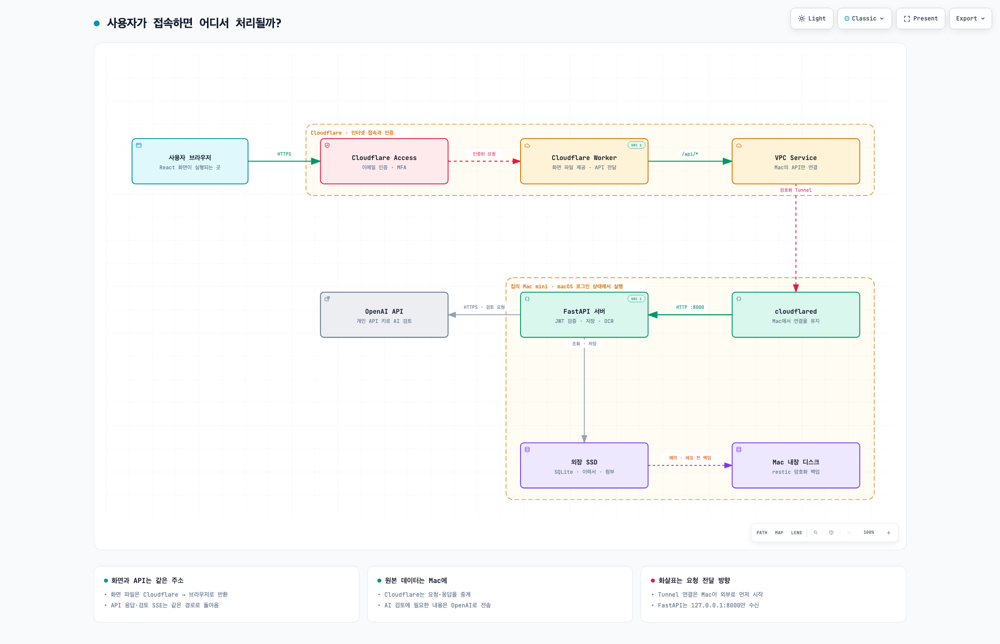
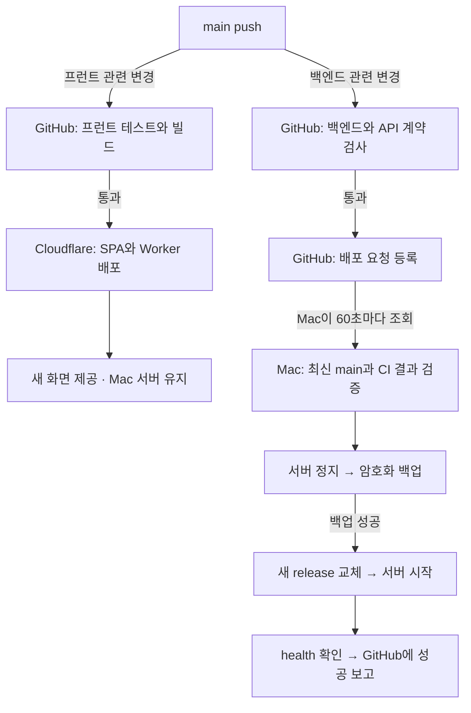

# Resume Agent

이력서 원문을 바꾸지 않고, 근거가 있는 수정 위치와 방향을 제안하는 웹 서비스다. 현재 운영 사이트는 초대된 사용자용 서버 모드로 실행하며, 개발·미리보기용 로컬 모드 코드는 별도로 남아 있다.

## 아키텍처 이해하기

**사용자는 브라우저로 접속하고, Cloudflare가 인증과 화면 전달을 맡으며, 집의 Mac mini가 자료 저장과 문서 처리를 맡는다. AI 검토는 OpenAI API가 수행한다.** GitHub는 코드를 검사하고 배포할 때 사용한다.

서비스 주소: **https://resume-agent.yelihi19.workers.dev**

2026-09-26 운영 구성 기준이다. 아래 설명은 실제 배포 코드와 설정을 기준으로 작성했다. [구성 요소](#1-각각-무슨-일을-하나요) → [사이트 접속](#2-사이트를-열면-무슨-일이-일어나나요) → [AI 검토](#3-이력서-검토-버튼을-누르면) → [자동 배포](#4-main에-push하면-무엇이-바뀌나요) → [저장과 복구](#5-데이터와-키는-어디에-남나요) 순서로 읽으면 된다.

[](docs/architecture/runtime.visual-check.2048x1320.light.png)

**[인터랙티브 구성도 바로 열기](https://yelihi.github.io/resume-agent/)** · [HTML 파일](docs/architecture/runtime.html) · [다크 테마 그림](docs/architecture/runtime.visual-check.2048x1320.dark.png) · [그림 원본 JSON](docs/architecture/runtime.architecture.json) · [검증 기록](docs/architecture/README.md)

GitHub README에서는 위 정적 그림을 보고, **구성도 바로 열기** 링크에서는 다운로드 없이 확대, 노드 선택, 연결 추적, 테마 전환을 사용할 수 있다. GitHub Pages가 `main`의 `docs/` 폴더를 게시하며, 운영 서비스와 별개의 공개 문서 페이지다. 로컬에서는 프로젝트 루트에서 `open docs/architecture/runtime.html`로 연다. 설명은 한국어이며 Archify 고정 메뉴와 HTML 언어 설정은 영어다.

### 1. 각각 무슨 일을 하나요?

| 구성 요소 | 실제 위치 | 하는 일 |
| --- | --- | --- |
| 프런트엔드, React | 실행: 사용자 브라우저 / 배포 파일: Cloudflare | 화면 표시, 입력, API 요청, 검토 진행 표시 |
| Cloudflare Access | Cloudflare | 허용된 사용자의 이메일 인증·MFA를 확인하는 입구 |
| Cloudflare Worker | Cloudflare | 화면 요청에는 빌드 파일을 반환하고, `/api/*` 요청은 Mac으로 전달 |
| VPC Service | Cloudflare | Worker가 연결할 특정 내부 서비스 지정. 현재는 Mac의 `127.0.0.1:8000` |
| Tunnel / `cloudflared` | 연결: Cloudflare ↔ Mac / 프로그램: Mac | Mac의 API까지 이어지는 암호화 연결 유지 |
| 백엔드, FastAPI | Mac mini | 사용자 권한 확인, 이력서·첨부 관리, 문서 추출·OCR, AI 호출과 결과 저장 |
| SQLite + 원본 파일 | Mac에 연결한 외장 SSD | 사용자별 작업 공간, 검토 결과, 이력서와 첨부의 영구 저장 |
| OpenAI API | OpenAI | 검토에 필요한 내용을 받아 AI 추론 수행 |
| `launchd` | macOS | 로그인 후 서버·Tunnel을 시작하고, 배포 확인·예약 백업 실행 |
| GitHub Actions | GitHub의 임시 실행 환경 | 변경 코드 테스트·빌드, Cloudflare 배포 또는 Mac 배포 요청 |

**Worker와 FastAPI는 서로 다른 프로그램이다.** Worker는 인터넷에서 요청을 받는 작은 전달 프로그램이고, FastAPI는 실제 데이터를 읽고 검토를 수행하는 Python 서버다. React 코드도 Worker 내부에서 화면을 그리는 것이 아니라, 전달받은 파일을 브라우저가 실행한다.

**VPC Service는 목적지 설정, Tunnel은 그 목적지로 가는 연결이다.** Tunnel의 연결 자체는 Mac의 `cloudflared`가 Cloudflare 쪽으로 먼저 시작한다. 그림의 아래쪽 화살표는 그 연결 위로 API 요청이 전달되는 방향이다. 집 공유기에 8000 포트를 개방하거나 고정 공인 IP를 준비할 필요가 없다. 같은 Mac 내부의 마지막 구간만 HTTP이며 FastAPI는 `127.0.0.1:8000`에서만 수신한다.

### 2. 사이트를 열면 무슨 일이 일어나나요?

1. 브라우저가 서비스 주소로 **HTTPS 요청**을 보낸다.
2. **Access**가 로그인 상태를 확인한다. 필요하면 이메일 인증·MFA를 진행한다.
3. **Worker**가 HTML·JavaScript·CSS 파일을 반환한다. 브라우저가 이를 실행해 React 화면을 표시한다. 이 화면 파일 요청은 Mac까지 가지 않는다.
4. 화면이 저장된 작업 공간을 불러오려면 같은 서비스 주소의 **`/api/...`**에 요청한다.
5. Worker가 Access의 인증 토큰(JWT)을 전달한다. **VPC Service → Tunnel → Mac의 FastAPI**로 요청이 이어진다.
6. FastAPI는 JWT의 서명·대상·만료와 초대된 활성 계정 여부를 검증하고, 그 사용자에게 허용된 데이터를 읽는다.
7. 응답이 **FastAPI → Tunnel → Worker → 브라우저**로 돌아와 화면에 표시된다.

따라서 사용자가 알아야 할 주소는 서비스 주소 하나다. 긴 `cloudflareaccess.com` 주소는 로그인용이며, 휴대폰의 `localhost:8000`은 집의 Mac이 아니라 휴대폰 자신을 뜻한다. 사용자의 기기에는 Python·Docker·VPN·Cloudflare 관리자 계정이 필요 없다.

### 3. 이력서 검토 버튼을 누르면

**브라우저 → 인증된 API 경로 → FastAPI → OpenAI → FastAPI → 브라우저** 순서로 처리한다.

FastAPI가 저장된 이력서·선택 자료를 준비하고 해당 사용자의 개인 OpenAI API 키로 검토를 요청한다. 문서 추출과 OCR은 Mac에서, AI 추론은 OpenAI에서 실행된다. 검토 진행은 SSE라는 연속 응답으로 같은 API 경로를 통해 화면에 전달된다. 완료 결과는 서버에 저장되어 나중에 같은 계정으로 다시 조회할 수 있다.

Cloudflare에는 별도의 이력서 DB를 두지 않았지만 업로드와 API 요청·응답은 Cloudflare를 경유한다. AI 검토에 필요한 내용은 OpenAI로 전송된다. 개인 키 등록 시에도 HTTPS API 경로로 서버에 전송되며, 이후 화면에는 키 원문 대신 등록 여부와 마스킹된 값만 반환한다.

### 4. main에 push하면 무엇이 바뀌나요?

**CI는 변경 코드 검사, CD는 검사한 코드를 운영 환경에 반영하는 작업이다.** 현재 프런트·백엔드 CD가 각각 활성화되어 있다. 둘 다 수정하면 아래 두 경로가 독립적으로 실행된다.



이 배포 그림은 README에서 바로 표시되는 Mermaid다. 위 서비스 구성도와 탐색용 HTML은 Archify로 생성했다.

| 바꾼 파일 | 실행되는 경로 | 운영에 미치는 영향 |
| --- | --- | --- |
| `frontend/**`, `deploy/cloudflare/**` | 프런트 workflow | 화면 파일·Worker 교체. Mac 서버 재시작과 DB 백업은 실행하지 않음 |
| `backend/**`, Cloudflare·Markdown 외 `deploy/**` | 백엔드 workflow | 백업 후 Python 서버 교체·재시작. 잠깐 API 사용 중단 |
| `frontend/openapi.json`, `frontend/src/infrastructure/http/schema.d.ts` | 두 workflow | 프런트 경로이면서 백엔드 API 계약 파일이므로 양쪽 검사·배포 |
| 각 workflow 파일 | 해당 workflow | 그 workflow의 검사·배포 |
| README 등 위 경로 밖의 문서만 | 앱 CI/CD 실행 안 함 | 서비스 그대로 유지. GitHub Pages는 main에서 docs를 다시 게시할 수 있음 |

**GitHub가 Mac에 SSH로 들어가 배포하는 구조는 아니다.** Mac의 배포 감시 프로그램이 GitHub에 요청을 조회하고 검증된 코드를 가져온다. 운영 Mac에는 GitHub Actions runner가 없으며, 저장소 공개 범위도 그대로다. PR에서는 검사만 수행하고 운영 배포는 하지 않는다.

프런트 배포에는 GitHub Secret의 `CLOUDFLARE_API_TOKEN`을 사용한다. Mac의 데이터·개인 키·백업 암호는 GitHub에 올리지 않는다. 배포 시 코드 release만 바꾸고 기존 데이터 경로와 서버 설정을 이어 쓴다. Tunnel과 매일 새벽 4시 백업 예약도 유지된다. Mac 컴퓨터 자체를 재부팅하는 작업은 아니다.

CI가 실패하면 배포 단계로 넘어가지 않는다. 백엔드의 배포 전 백업이 실패하면 기존 서버를 다시 시작한다. 새 서버의 health 검사에 실패하면 새 서버를 정지하고 복구를 판단해야 하며, DB 변경 가능성 때문에 이전 코드로 무조건 자동 롤백하지 않는다. 배포 중 진행 중이던 AI 검토는 중단될 수 있다. 양쪽 배포 순서는 보장되지 않으므로 API를 함께 바꿀 때는 이전 버전과 호환되게 변경한다.

실제 성공 기록: [백엔드 백업·재시작](https://github.com/Yelihi/resume-agent/actions/runs/36233813955), [프런트 Cloudflare 게시](https://github.com/Yelihi/resume-agent/actions/runs/36235148306). 프런트 첫 실행의 VPC 권한 오류는 기존 토큰에 `Connectivity Directory Bind`를 추가한 뒤 같은 실행을 재시도해 해결했다. 세부 설정은 [CI/CD 운영 안내](deploy/CI_CD.md)에 있다.

### 5. 데이터와 키는 어디에 남나요?

| 항목 | 저장 위치 | 배포·재시작 시 |
| --- | --- | --- |
| 실행 코드 | 외장 SSD의 `server/resume-agent/release/current` | 검증된 새 release로 전환 |
| DB·원본 파일 | 외장 SSD의 `server/resume-agent/data` | 기존 자료 유지 |
| 개인 OpenAI API 키 | DB에 사용자별 Fernet 암호문으로 저장 | 같은 계정이면 계속 사용 |
| 서버 설정·Fernet 키·Tunnel 토큰·백업 암호 | Mac의 `~/.config/resume-agent/` | 기존 파일 사용 |
| restic 백업 | Mac 내장 디스크의 `~/Library/Application Support/resume-agent-backup/restic` | 예약 실행과 백엔드 배포 전 새 스냅샷 생성 |
| Cloudflare 배포 토큰 | GitHub Actions Secret | 이후 프런트 배포에서 계속 사용 |

**현재 운영 사이트의 작업 데이터 저장에는 IndexedDB를 사용하지 않는다.** 서버가 반환하는 계정 모드가 `server`이면 프런트는 API 기반 저장소를 선택한다. IndexedDB는 코드에 남아 있는 로컬 개발·브라우저 미리보기와 기존 데이터 내보내기에 사용한다. 서버 연결 실패 시 자동으로 로컬 저장으로 전환하지도 않는다. 코드에서 로컬 모드 자체를 제거한 상태와 운영을 서버 모드로 전환한 상태는 구분한다.

**파일 스토리지는 맥미니에 연결된 외장 SSD의 파일시스템이다.** 별도 S3·R2·MinIO 없이 FastAPI가 다음 위치에 직접 저장한다.

```text
/Volumes/Storage2TB/server/resume-agent/data/
├── resume.sqlite3   # 작업 데이터, 파일 ID·소유자·원래 이름·형식·크기
└── files/
    └── <파일 UUID>  # 업로드된 원본 파일의 바이트
```

`files/` 폴더는 첫 파일 업로드 때 자동 생성한다. 파일 본문을 먼저 디스크에 기록한 뒤 DB에 정보를 등록하고 작업 데이터에서는 파일 ID를 참조한다. 다운로드는 인증된 `/api/files/{file_id}`를 통해 소유자를 확인한 뒤 제공한다. 따라서 “DB에 저장”은 파일의 설명·참조를, “스토리지에 저장”은 파일 본문을 뜻한다. DB와 파일은 서로 분리되어 있지만 현재는 같은 외장 SSD에 있다.

외장 SSD가 고장 나면 내장 백업에서 마지막 성공 시점의 DB·파일을 복원할 수 있다. 복원은 별도 위치에서 무결성을 확인한 뒤 운영에 반영한다. 암호화된 개인 키를 다시 읽으려면 기존 Fernet 키도 필요하다. Mac 자체를 잃으면 내장 백업도 함께 잃을 수 있으므로 현재 구성은 원격 재해 복구 백업까지 제공하지 않는다.

개인 API 키는 한 번 등록하면 브라우저를 바꾸거나 정상 배포·재시작을 해도 다시 입력할 필요가 없다. 로그인 세션이 만료되는 것과 API 키가 저장되는 것은 별개다. 키를 폐기·삭제·교체했거나 DB/암호화 키를 잃었을 때는 재등록 또는 복구가 필요하다. **현재 배포에 Docker는 필요 없다.** macOS의 Python 가상환경과 `launchd`로 실행한다.

### 6. 무엇을 어디에서 확인하면 되나요?

| 궁금한 상태 | 확인할 곳 |
| --- | --- |
| push 후 검사·배포가 끝났는가? | [GitHub Actions](https://github.com/Yelihi/resume-agent/actions) |
| Mac 배포가 실제 성공했는가? | [GitHub Deployments](https://github.com/Yelihi/resume-agent/deployments)의 `production-backend` |
| 프런트 버전·요청·오류 | Cloudflare → Workers & Pages → `resume-agent` → Deployments / Metrics |
| Mac까지 연결되는가? | Cloudflare의 Tunnels 화면에서 연결 상태 |
| Python 서버가 살아 있는가? | Mac에서 `python3 deploy/check-service.py` |
| 백업이 성공했는가? | 서비스 설정의 운영자 백업 상태, Mac의 `data/backup-status.json` |
| Mac 배포 실패 원인 | `~/.config/resume-agent/deployment/deploy.log` |

Mac 전원·인터넷·외장 SSD 연결·macOS 로그인 상태가 필요하다. 화면 잠금은 가능하며 Codex를 종료해도 서버·Tunnel·예약 백업은 유지된다. Mac이 꺼지면 Cloudflare의 화면 파일은 제공될 수 있어도 저장·조회·검토 API는 사용할 수 없다. OpenAI 문제는 AI 기능에, GitHub 문제는 새 배포에 영향을 준다.

현재 별도의 자동 장애 알림은 없다. 예약/배포 전 백업과 서버 재시작은 확인했지만, 실제 AI 검토·앱 첨부를 포함한 복원·Mac 전체 재부팅 후 로그인 복구는 별도 실사용 검증이 남아 있다. 점검 명령과 복구 절차는 [운영 설명서](deploy/OPERATIONS_GUIDE.md)를 따른다.

<details>
<summary>설명과 실제 코드를 연결해서 보기</summary>

| 설명 | 근거 |
| --- | --- |
| 화면 파일과 `/api` 요청 분리, JWT 전달, SSE 중계 | [worker.mjs](deploy/cloudflare/worker.mjs) |
| JWT와 초대 계정 검증 | [auth.py](backend/app/deployment/auth.py) |
| 사용자 API 키 암호화·복호화 | [keys.py](backend/app/deployment/keys.py) |
| 프런트 검사·Cloudflare 배포 | [frontend.yml](.github/workflows/frontend.yml) |
| 백엔드 검사·배포 요청 | [ci.yml](.github/workflows/ci.yml) |
| Mac의 배포 요청 검증·조회 | [github-deploy.py](deploy/github-deploy.py) |
| 백업 후 release 전환·실패 처리 | [release.py](deploy/release.py) |
| DB·파일 스냅샷과 복원 검증 | [backup.py](backend/scripts/backup.py) |

</details>

## 구성

- `frontend`: React, Vite, TypeScript, PDF.js. IndexedDB 구현은 로컬 개발·미리보기용으로 유지한다.
- `backend`: FastAPI, PyMuPDF, PaddleOCR, OpenAI Responses API
- 로컬 모드는 IndexedDB, 초대형 서버 모드는 SQLite와 인증된 파일 저장소에서 작업 공간·이력서 버전·자료·검토·제안을 관리한다.
- 새 이력서는 독립 작업 공간으로, 수정본은 같은 작업 공간의 다음 버전으로 저장한다. 수정본의 연속성은 사용자가 판단한다.
- 제안별 좋아요/싫어요와 Resolve/Skip을 저장한다. 다음 검토는 같은 작업 공간의 피드백만 사용하며 AI가 반영을 확인한 제안은 현재 목록에서 제외한다.
- 자료는 추출 → 확인·수정 → 명시적 저장 후 사용할 수 있다. 보관함 자료를 여러 작업 공간에 연결하고 검토마다 사용 버전을 고정한다.
- `경험 기록`에서 Markdown 본문을 직접 작성하거나 옆에 링크·문서를 첨부해 AI로 상세 경험 템플릿을 만든다. 초안은 수정할 수 있고, 편집기 상단의 Markdown/Preview 탭으로 즉시 확인한다. 메타데이터는 별도로 생성·수정한 뒤 최종 저장한다. 본문과 메타데이터는 문제 → 분석 → 해결 → 기대 결과 흐름을 따르며 실제 성과와 기대 효과를 구분한다. 본문·제목·기간을 바꾸면 메타데이터를 다시 생성한다.
- 경험 본문을 확인한 뒤 상단 `메타데이터 생성`을 누르면 어필할 핵심 기여 하나와 원문 인용·확인할 점, 예상 질문·답변 근거를 제안한다. 구현·테스트·통과 결과를 별개 성과로 늘리지 않고 한 기여로 묶는다. 어필 포인트는 상단에서 자유롭게 추가·수정하고, 질문·답변 메모·근거는 본문 아래 `면접 준비`에서 수정한다. 질문은 직접 추가·삭제할 수 있으며 경험당 최대 20개를 저장한다. `최종 저장` 후 경험 보관함에서 질문을 펼쳐 읽거나 `경험 수정`으로 보완한다.
- 준비 메모는 이력서별이 아닌 경험 자료에 저장하며, 이력서 검토의 사실 근거에 자동 편입하지 않는다. 메타데이터 재생성은 기존 어필 포인트와 질문·답변을 보존하고 빈 영역만 채운다. 본문이 바뀌면 기존 준비 메모도 직접 확인한다. AI 답변의 인용 근거는 경험 본문과 대조한다. 근거가 없거나 본문과 일치하지 않으면 해당 답변과 근거만 비우고 질문은 남긴다. 링크 접근 방식은 기존과 같다.
- 자동 분석은 생성 후 원문과 의미를 대조하는 검수를 거친다(AI 호출 2회). 검수 실패 시 미검수 초안을 반환하지 않으며 기존 작성 내용은 유지된다. 어필 포인트도 인용이 본문과 일치할 때만 제안한다.
- 경험 Markdown 본문에 표시하는 이미지는 외부 HTTP(S) URL을 사용한다. 해당 편집기의 직접 이미지 업로드·호스팅은 지원하지 않는다. 이력서·자료로 업로드해 저장한 문서 원본은 운영 서버 모드에서 외장 SSD의 파일 저장소에, 로컬 모드에서 IndexedDB에 보관한다.
- 이력서 검토에서 경험을 직접 고르면 JD 적합성에 따라 문구 또는 생략 이유를 제공한다. 다른 경험은 근거와 함께 추천하고 사용자가 추가를 선택한 뒤 문구를 작성한다. 경험을 고르지 않으면 저장된 경험 중 JD에 맞는 경험을 자동 추천·작성한다. JD가 없으면 경험 추천을 실행하지 않는다.
- 검토 당시 경험·이력서·JD 버전을 고정하므로 이후 원본 편집이 과거 추천을 바꾸지 않는다. 경험 생성은 전용 페이지에서만 하며, 기존 작업 공간 작성본은 보관함에서 열어 편집·복사할 수 있다. 이력서 파일에 자동 삽입하지 않는다.
- 완료 결과 저장 후 서버 실행 기록을 해제한다. 재실행 시 관계를 따라 `ReviewRecord`를 구성하므로 서버 재시작 후에도 재실행할 수 있다.
- 자동 만료와 Reset은 없다. 작업 공간 삭제 시 해당 이력서·검토·피드백을 정리하며 공용 자료는 유지한다. 앞으로 저장하는 이력서·자료 버전의 원본을 보관하며 과거에 삭제된 원본은 복구하지 못한다.
- 초대형 서버의 Cloudflare·Mac 배포와 프런트/백엔드 자동 배포를 구성했다. 현재 검증 범위는 [운영 설명서](deploy/OPERATIONS_GUIDE.md), 설치 과정은 [Mac 설정](deploy/MAC_MINI_SETUP.md), 자동 배포는 [CI/CD](deploy/CI_CD.md)를 따른다. [Docker](deploy/DOCKER.md)는 현재 운영에 사용하지 않는 별도 선택이다. 개인화·채용 트렌드 분석은 후속 계획이다.

## 실행

Python 3.12, [uv](https://docs.astral.sh/uv/), Node.js와 pnpm이 필요하다.

터미널 1:

```bash
cd backend
uv sync
uv run --env-file .env uvicorn app.main:app --reload
```

터미널 2:

```bash
cd frontend
pnpm install
pnpm dev
```

`http://localhost:5173`을 연다. Vite가 `/api` 요청을 `http://localhost:8000`으로 전달한다.

문서 추출만 확인할 때는 키를 생략해도 된다. 실제 AI 검토에는 `backend/.env`의 `OPENAI_API_KEY`가 필요하다. 모델은 기본적으로 `gpt-5.4-mini`이며 `OPENAI_MODEL`로 바꿀 수 있다. 키는 브라우저에 전달하거나 저장하지 않는다.

## 검증

```bash
cd backend
uv run pytest

cd ../frontend
pnpm test
pnpm build
```

OpenAPI 타입을 갱신하려면:

```bash
cd backend
uv run python -m scripts.export_openapi ../frontend/openapi.json
cd ../frontend
pnpm types:api
```

실제 OpenAI 품질 평가는 비용이 발생하므로 명시적으로만 실행한다.

```bash
cd backend
RUN_AI_EVAL=1 OPENAI_API_KEY=... uv run pytest -m ai
```

문서는 [docs 문서 안내](docs/README.md)에서 찾을 수 있다. 설계 기준은 [docs/design](docs/design/DESIGN_NOTES.md), 구현·배포 계획은 [docs/plan](docs/plan/), 단계별 결과와 이슈·테스트 기록은 [docs/phase](docs/phase/)에 있다. [용량 확장·자료 삭제·원본 복구 안내](docs/plan/STORAGE_MANAGEMENT.md)도 참고한다.
