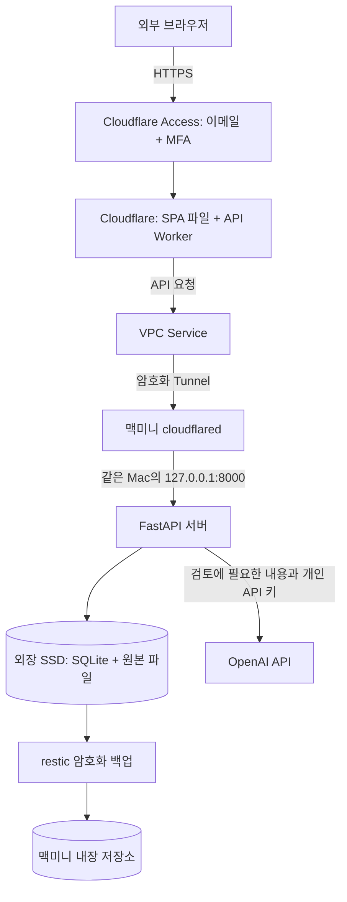

# Resume Agent 운영 설명서

2026-09-26 확인 기준. 현재 실행 상태는 이 문서를, 설치 과정은 [MAC_MINI_SETUP.md](MAC_MINI_SETUP.md)를 참고한다. 비밀 값은 이 문서에 기록하지 않는다.

## 외부에서 접속

1. 휴대폰이나 외부 PC의 일반 브라우저에서 https://resume-agent.yelihi19.workers.dev 를 연다.
2. Cloudflare Access에서 허용된 본인 이메일로 이메일 인증 코드를 받는다.
3. 필요한 경우 등록한 인증 앱의 MFA 코드를 입력한다. 유효한 로그인 세션이 있으면 일부 단계가 생략된다.
4. 서비스 화면에서 저장된 자료를 조회한다. AI 검토에는 설정 화면의 개인 OpenAI API 키 등록이 필요하다.

접속 기기에 Docker, Python, cloudflared, VPN, Cloudflare 관리자 계정은 필요하지 않다. 등록된 인증 앱과 이메일에 접근할 수 있어야 한다. 맥미니의 전원·인터넷·외장 SSD·macOS 사용자 로그인 세션은 유지되어야 한다. 화면 잠금과 화면 꺼짐은 가능하지만 로그아웃·시스템 잠자기·종료는 피한다.

다른 기기의 `localhost:8000`은 그 기기 자신을 뜻하므로 운영 주소로 사용하지 않는다. `raspy-butterfly-055e.cloudflareaccess.com`은 로그인/App Launcher 주소다. 평소에는 위 workers.dev 서비스 주소만 사용한다.

## 실행 구조



프런트엔드 빌드 파일은 Cloudflare가 제공하고 React 화면은 사용자 브라우저에서 실행된다. Python API 서버, 문서 처리/OCR, DB와 원본 파일 관리는 맥미니가 담당한다. AI 추론은 OpenAI API가 담당한다. 현재 Docker 컨테이너는 사용하지 않고 macOS의 Python 가상환경으로 실행한다.

브라우저는 같은 서비스 주소의 `/api/...`를 호출한다. Worker는 지정된 VPC Service를 통해 Mac의 API로 전달하고 응답을 돌려준다. 검토 진행 이벤트는 스트리밍으로 전달한다. Cloudflare에 이력서 DB를 별도로 만들지는 않았지만 요청/응답 데이터는 Cloudflare를 경유한다. AI 검토에 필요한 내용은 OpenAI로 전송된다.

`cloudflared`가 Mac에서 Cloudflare로 연결을 시작하므로 이 구성에는 공유기 포트 포워딩·고정 공인 IP·유료 도메인이 필요하지 않다. 브라우저 구간은 HTTPS, Tunnel 구간은 암호화되며 마지막 HTTP 구간은 같은 Mac 내부다. 서버는 `127.0.0.1:8000`만 수신하며 집 내부망 전체를 VPC에 연결하지 않았다. nginx는 설치하지 않았다.

[Cloudflare Tunnel 원리](https://developers.cloudflare.com/cloudflare-one/networks/connectors/cloudflare-tunnel/), [Workers VPC](https://developers.cloudflare.com/workers-vpc/).

## 지금까지 진행한 과정

1. M4/16GB Mac mini와 APFS 외장 SSD를 확인했다. 기존 222GB 파일을 지우거나 SSD를 포맷하지 않았다. 현재 macOS 사용자로 운영하기로 했다.
2. 개발 저장소와 별도로 외장 SSD에 서비스 폴더를 만들고 소유권·권한을 설정했다. SSD UUID와 표시 파일을 검사하여 잘못된 디스크나 미연결 상태에서 시작하지 않도록 했다.
3. CI를 통과한 커밋 `6be063bf437629ecc4d33598a312bb3138665880`을 운영 release에 설치했다. 붙여넣기 과정의 경로 줄바꿈 문제를 수정하고 Python 가상환경을 다시 만들었다.
4. Git 밖에 서버 설정, API 키 암호화용 Fernet 키, Tunnel 토큰을 보관했다. 본인 이메일을 서버 DB에 초대했다.
5. Cloudflare의 무료 주소, Access 이메일 허용 정책, 이메일 PIN, 앱별 MFA와 App Launcher를 구성했다. 본인 인증 앱 등록과 실제 로그인을 확인했다.
6. 정식 Tunnel과 `resume-agent-api` VPC Service를 연결했다. Wrangler OAuth로 Cloudflare 배포 권한을 승인하고 SPA와 API Worker를 배포했다. MCP는 현재 서비스 실행의 필수 구성 요소가 아니다.
7. 내장 디스크에 restic 암호화 백업을 만들고 전체 읽기 검사·별도 위치 복원·DB/manifest 검증을 통과했다. 당시 실제 첨부 파일은 없어 첨부 복원 시험은 남아 있다.
8. 예약 백업이 macOS 외장 볼륨 접근 제한으로 실패했다. 전용 `Resume Agent Service.app`을 만들고 사용자가 ‘제거 가능한 볼륨’을 허용하여 해결했다. 이 앱은 서버/백업 실행만 담당하며 Docker나 별도 웹 서버가 아니다.
9. 서버와 Tunnel을 LaunchAgent로 전환하고 매일 새벽 4시 백업을 등록했다. 수동 서버 프로세스는 종료했으며 터미널을 닫아도 서비스가 유지된다.

## 현재 확인 결과

| 항목 | 상태 |
| --- | --- |
| 운영 사이트 배포 | 완료, 본인 로그인과 서버 계정 생성 확인 |
| app / tunnel LaunchAgent | running |
| 서버 health | 200 |
| 인증 없는 API 요청 | 401 |
| 운영 API 문서 `/docs` | 404 |
| 예약/배포 전 백업 | 예약 실행 종료 코드 0, 최신 배포 전 백업 2026-09-26 18:48:13 KST 성공 |
| GitHub CI | 성공 |
| 운영 CD | 백엔드·프런트 true (각각 main push 배포 성공, 프런트는 권한 보완 후 동일 실행 재시도) |
| preview CD | false |
| GitHub 공개 범위 | PUBLIC |
| 실제 AI 검토 / 파일별 OCR | 이번 설치에서 아직 미검증 |
| 실제 재부팅 후 복구 | 아직 미검증 |

[분리한 프런트 CI 성공](https://github.com/Yelihi/resume-agent/actions/runs/36232890657), [분리한 백엔드 CI 성공](https://github.com/Yelihi/resume-agent/actions/runs/36232890668). 예약 백업은 종료 후 `not running`으로 표시되는 것이 정상이며 마지막 종료 코드와 성공 시각을 확인한다.

## 로그인과 권한의 원리

Access는 허용 이메일과 MFA를 검사한다. 브라우저의 로그인 유지에는 Access 쿠키를 사용하고, Mac 서버에는 서명된 JWT가 전달된다. 자체 비밀번호 로그인이나 localStorage의 수동 로그인 토큰을 추가하지 않았다. 쿠키는 브라우저에서 인증을 유지하는 방식이고 JWT는 서버가 신원을 검증하는 형식이므로 함께 사용한다.

Worker가 지정한 헤더의 JWT를 백엔드가 서명·발급자·대상(AUD)·만료까지 검증한다. 이어서 서버 DB의 초대 여부와 정지 상태를 검사한다. 각 자료의 소유권도 확인한다. AUD는 이 Access 앱을 식별하는 값이며 비밀번호/API 키가 아니다. Tunnel ID 역시 식별자지만 Tunnel 토큰은 비밀이다.

사용자 화면으로 확인한 앱 로그인 세션과 앱별 MFA 지속 시간은 각각 6시간이다. Cloudflare 관리자 계정의 MFA, 이 서비스의 Access MFA, Mac 로그인 암호는 별개다. [Access 쿠키](https://developers.cloudflare.com/cloudflare-one/access-controls/applications/http-apps/authorization-cookie/), [독립 MFA](https://developers.cloudflare.com/cloudflare-one/access-controls/access-settings/independent-mfa/).

개인 OpenAI API 키는 앱 설정에서 등록하고 DB에 암호화해 저장한다. 복호화용 `fernet.key`는 별도 파일이다. 원문 키를 조회 API로 돌려주지 않는다. 다만 서버 실행 사용자 권한이 침해되면 데이터와 복호화 키에 접근할 수 있다. 원본 이력서와 DB 전체의 디스크 암호화는 이번 범위에서 적용하지 않았다.

## 파일 위치

| 용도 | 위치 |
| --- | --- |
| 개발/Git 저장소 | `/Volumes/Storage2TB/Projects/github/resume-agent` |
| 운영 코드 | `/Volumes/Storage2TB/server/resume-agent/release/current` |
| DB·이력서 원본 | `/Volumes/Storage2TB/server/resume-agent/data` |
| 모델 캐시 | `/Volumes/Storage2TB/server/resume-agent/model-cache` |
| 백업 임시 작업 | `/Volumes/Storage2TB/server/resume-agent/backup-staging` |
| 개인 설정·키 | `/Users/yelihi/.config/resume-agent` |
| 암호화 백업 | `/Users/yelihi/Library/Application Support/resume-agent-backup/restic` |
| 자동 실행 설정 | `/Users/yelihi/Library/LaunchAgents/com.resume-agent.*.plist` |
| 외장 접근용 전용 앱 | `/Users/yelihi/Applications/Resume Agent Service.app` |
| 배포 감시 전용 앱 | `/Users/yelihi/Applications/Resume Agent Deploy.app` |
| 배포 감시/로그/checkout | `/Users/yelihi/.config/resume-agent/deployment` |

서비스 데이터는 Git 저장소 밖에 있다. 개발 코드를 수정해도 현재 운영 코드는 자동으로 바뀌지 않는다. Python 실행 도구·launchd 설정·비밀 파일 등 일부는 내장 디스크에 있으며 모든 구성 요소를 외장으로 옮긴 것은 아니다.

설정 폴더에는 `server.env`, `backup.env`, `fernet.key`, `tunnel.token`, `restic-password`가 있다. 설정·비밀 파일은 권한 600, 서비스 전용 디렉터리는 700으로 제한했다. 기존 Fernet 키나 백업 비밀번호를 임의로 재생성하지 않는다. DB 백업에 이 설정 폴더가 함께 들어가는 것은 아니다.

## 백업과 비용

매일 04:00에 DB와 DB가 참조하는 원본 파일의 일관된 사본을 만들고 무결성을 확인한 뒤 restic으로 암호화해 내장 저장소에 보관한다. 보존 규칙은 일별 7개, 주별 4개, 월별 3개이며 중복 기간이 있으므로 단순히 항상 14개가 생긴다는 뜻은 아니다. 오래된 보존 대상 밖의 백업은 정리한다.

백업은 로컬 저장소만 허용하고 R2 같은 원격 스토리지를 사용하지 않는다. 클라우드 저장 초과 과금은 없지만 디스크 용량은 소모한다. 내장 여유 공간은 확인 당시 약 24GiB이며 자동 총용량 제한은 없다. 외장 SSD 고장에 대비할 수 있지만 Mac 전체 손실·동시 디스크 손실·실행 사용자 침해까지 분리된 백업은 아니다.

복원은 별도 폴더에서 restic 복원 → DB·원본 검증 → 서버 정지 → 검증된 자료로 교체 → 재시작 순서로 진행한다. 운영 중 DB에 바로 덮어쓰지 않는다. 백업 비밀번호가 필요하며 저장된 API 키를 복호화하려면 기존 Fernet 키도 필요하다. 현재 이 비밀 값들의 장치 밖 복구 사본은 마련되지 않았다.

도메인은 구매하지 않았다. Workers VPC는 확인 시점에 공개 베타 동안 무료이며 Worker 요청/연산에는 Workers 요금제가 별도로 적용된다. 영구 무료를 보장하는 구조는 아니다. [공식 요금 설명](https://developers.cloudflare.com/workers-vpc/platform/pricing/). AI 검토에는 개인 OpenAI API 사용료가 발생한다. 이번 설치에서는 유료 AI 호출을 실행하지 않았다.

## 계정 추가와 차단

새 사용자를 받으려면 운영자가 Cloudflare Access 허용 정책에 이메일을 추가하고 서버에도 같은 이메일을 초대해야 한다. App Launcher를 쓰게 할 경우 Launcher 정책도 허용되어야 한다. 현재 공유하는 `resume-owner` 정책을 편집하면 연결된 앱에도 영향을 준다. 사용자는 이메일 로그인과 자신의 MFA 등록을 진행한다. Cloudflare 관리자 계정을 공유하지 않는다.

Mac 터미널에서 사용자 목록 확인:

```sh
cd /Volumes/Storage2TB/server/resume-agent/release/current/backend
.venv/bin/python -m scripts.manage_users --data-dir /Volumes/Storage2TB/server/resume-agent/data list
```

초대 예시(주소 교체 필요):

```sh
.venv/bin/python -m scripts.manage_users --data-dir /Volumes/Storage2TB/server/resume-agent/data invite 'friend@example.com'
```

서버 초대 철회 예시:

```sh
.venv/bin/python -m scripts.manage_users --data-dir /Volumes/Storage2TB/server/resume-agent/data revoke 'friend@example.com'
```

CLI는 허용 목록을 수정하며 초대 메일을 보내지는 않는다. 정지에는 `disable '내부사용자ID'`, 재활성화에는 `enable '내부사용자ID'`를 사용한다. 접근 철회 시 Cloudflare 허용 정책과 기존 Access 세션도 처리한다. 계정 정지·초대 철회는 자료 삭제와 별개다. 운영자 ID는 본인 계정으로 등록했으며 앱의 백업 상태 조회에 사용한다.

## 일상 운영과 점검

화면을 잠그거나 모니터를 꺼도 된다. Mac 전원·인터넷·외장 SSD는 유지한다. 컴퓨터 자동 잠자기는 현재 꺼져 있고 전원 복구 후 자동 시작은 켜져 있다. LaunchAgent는 사용자 로그인 이후 실행하므로 재부팅·정전 후 로그인 전까지 무인 복구를 보장하지 않는다. 서비스 URL은 웹 앱 접속용이며 Mac 원격 데스크톱/SSH 접속을 설정한 것은 아니다.

서버·Tunnel 상태 조회:

```sh
launchctl print "gui/$(id -u)/com.resume-agent.app"
launchctl print "gui/$(id -u)/com.resume-agent.tunnel"
curl --fail http://127.0.0.1:8000/health
```

백업 성공 시각 확인:

```sh
cat /Volumes/Storage2TB/server/resume-agent/data/backup-status.json
```

예약 시각을 기다리지 않고 백업 실행 요청:

```sh
launchctl kickstart "gui/$(id -u)/com.resume-agent.backup"
```

필요할 때 서버 재시작(진행 중 검토는 중단될 수 있음):

```sh
launchctl kickstart -k "gui/$(id -u)/com.resume-agent.app"
```

| 증상 | 확인할 곳 |
| --- | --- |
| 로그인에서 거부 | 입력 이메일, Access 정책, MFA |
| 로그인 뒤 API 403 | 서버 초대·정지 상태, AUD 설정 |
| 화면은 뜨지만 데이터 API 502/503 | Mac 서버·Tunnel·SSD 연결 |
| 재부팅 뒤 접속 불가 | Mac 사용자 로그인, 외장 마운트, LaunchAgent |
| 백업 실패 | 마지막 성공 시각, 내장 여유 공간, 외장 접근 권한 |

## 관리·모니터링은 어디에서 하나요?

| 확인 대상 | 정확한 위치 | 볼 항목 |
| --- | --- | --- |
| CI·자동 배포 | [GitHub Actions](https://github.com/Yelihi/resume-agent/actions) | Frontend / Backend 각각 checks와 배포 job 성공 여부 |
| 서버 배포 이력 | [GitHub Deployments](https://github.com/Yelihi/resume-agent/deployments) | production-backend, 배포 SHA·상태 |
| 프런트 버전·트래픽 | [Cloudflare 대시보드](https://dash.cloudflare.com/) → Workers & Pages → resume-agent | Deployments, Metrics의 요청/오류 |
| Tunnel 연결 | Cloudflare Zero Trust → Networks → Tunnels/Connectors | resume-agent-mac-mini의 Healthy 상태 |
| 로그인·접근 거부 | Zero Trust → Access controls → Applications / Logs | resume-agent 정책·인증 기록 |
| 백업 | 서비스 로그인 → 설정의 운영자 백업 상태 | 최근 성공 시각·error |
| Mac 프로세스·용량 | 위 launchctl/curl 명령, macOS 활성 상태 보기, df | 서버/Tunnel 실행·health·메모리·내장/외장 여유 |
| Mac 배포 문제 | ~/.config/resume-agent/deployment/deploy.log | 백업/설치/health 실패 위치 |

현재 자동 장애 알림·별도 통합 모니터링 서버는 없다. Cloudflare의 상세 Worker observability 로그도 비활성이다. GitHub 성공은 실제 LTE 접속·AI·OCR 시험을 대신하지 않는다.

## main push와 자동 배포

프런트와 백엔드를 별도 workflow로 분리했다. 상세 설정·명령·실패 복구는 [CI_CD.md](CI_CD.md)를 따른다.

- 프런트/Worker 변경: GitHub에서 테스트·빌드 후 Cloudflare 배포. 서버를 재시작하지 않는다.
- 백엔드/운영 코드 변경: GitHub 검사 성공 → 배포 요청 → Mac이 검증된 main 코드 수신 → 서버 정지 → 기존 코드로 암호화 백업 → 새 release 교체·서버 시작 → health 확인 → GitHub 성공 보고.
- PR은 검사만 한다. 운영 저장소는 PUBLIC을 유지하며 Mac에 Actions runner를 등록하지 않는다. 배포 전용 LaunchAgent가 60초마다 요청을 확인한다.
- 두 배포는 독립 실행이므로 함께 변경할 때 API 하위 호환을 유지한다. 실패한 배포는 상태 확인 후 해당 workflow를 최신 main으로 다시 실행한다.
- Tunnel·새벽 4시 백업·개인 키는 배포 때 그대로 유지된다. Mac 재부팅 자체는 배포 과정에 포함하지 않는다.

기존 서비스 앱의 경로·설정은 유지했다. 자식 서버가 남는 문제를 고치기 위해 실행 파일만 기존 사본을 보관한 뒤 exec 방식으로 갱신했다. 별도 `Resume Agent Deploy.app`과 `com.resume-agent.deploy`를 추가했다. 새 앱의 외장 접근 권한과 기존 gh 인증이 필요하다. 감시 job은 대기 중 not running, 최근 종료 코드 0이면 정상이다.

## 주소·API 키·Docker

**주소:** 평소에는 https://resume-agent.yelihi19.workers.dev 한 개만 사용한다. 긴 Cloudflare Access 팀 주소는 로그인용이다. 가장 간단한 사용 방법은 서비스 주소를 북마크하거나 휴대폰 홈 화면에 추가하는 것이다. 더 짧은 실제 주소는 보유 도메인을 연결하거나 workers.dev 이름을 변경하면 가능하지만, Access 보호·서버 허용 Origin도 함께 검증해야 한다. 이번에는 도메인을 구매하거나 기존 인증 주소를 변경하지 않았다. [workers.dev 안내](https://developers.cloudflare.com/workers/configuration/routing/workers-dev/), [사용자 도메인](https://developers.cloudflare.com/workers/configuration/routing/custom-domains/).

**개인 API 키:** 한 번 등록하면 같은 서버 계정으로 로그인할 때 계속 사용한다. 브라우저/기기를 바꾸거나 서버를 정상 배포·재시작해도 재등록할 필요가 없다. 폐기·만료·삭제·교체했거나 저장 DB/기존 Fernet 키를 잃은 경우에는 재등록/복구가 필요하다. 로그인 세션 만료와 API 키 저장은 별개다. 사용자별 키이며 다른 사람에게 자동 공유되지 않는다. 이번 후속 점검 당시 등록 건수는 0개였다.

**Docker:** 현재 필요하지 않다. 프런트는 Cloudflare, 서버는 기존 macOS Python 가상환경 + launchd가 실행하고 배포 스크립트가 백업/교체/재시작을 담당한다. Docker 전환은 별도 선택이며 기존 네이티브 서버와 같은 DB를 동시에 열지 않는다.

## 후속 검증 기록 (2026-09-26)

- 외부 HTTPS 요청은 Access 로그인으로 이동한다. Chrome에서도 로그인 화면 확인. 인증 후 실제 화면/검토는 사용자 로그인 대기 중이다. 휴대폰 LTE/5G 등 별도 네트워크 접속은 아직 확인하지 않았다.
- app/Tunnel running, 로컬 health 정상, 기존 예약 백업 성공을 재확인했다.
- 기존 restic 키로 새 백업 실행, 전체 읽기 검사, 별도 임시 폴더 복원, manifest·SQLite·파일 해시 검증 통과. 해당 운영 스냅샷에는 첨부 0개다.
- 가상 첨부 1개를 별도 `resume-agent-attachment-drill` 태그로 실제 restic에 저장하고 복원해 해시·바이트 일치를 확인했다. 시험 snapshot은 `3a2ada37`이며 운영 데이터에는 추가하지 않았다. 앱 업로드부터 복원까지의 검증은 별도로 남아 있다.
- 로컬 검사: 백엔드 173개(유료 AI/OCR 2개 제외), 프런트 146개, Worker 2개, 배포 안전성 5개 통과. 프런트 빌드·API 계약 일치·Wrangler dry-run 통과.
- GitHub main 22ace24에서 프런트·백엔드 CI 모두 성공. 첫 실제 backend 배포 739a81c에서는 기존 서비스 앱의 자식 Python이 종료되지 않는 문제를 발견했다. 기존 release를 유지하고 실행 앱을 exec 방식으로 수정했다. 후속 main push `2162a10`은 CI → 백업 → 서버 교체·health → GitHub 성공 보고까지 통과했다. [실제 성공 실행](https://github.com/Yelihi/resume-agent/actions/runs/36233813955).
- 실제 Mac 전체 재부팅·재로그인 복구는 아직 미검증이다. 기존 로그인 세션을 유지한 채 서버 작업을 진행한다. 재부팅은 작업 저장과 로그인 가능한 시간에 실시하고, 로그인 뒤 app/tunnel/deploy 및 다음 예약 백업을 확인한다.

남은 실사용 검증: 개인 키 등록 → 가상 이력서/첨부 업로드 → 소규모 검토/SSE → 다른 브라우저에서 결과 조회 → 앱 첨부가 들어 있는 운영 백업 복원 → 실제 재부팅 후 로그인 복구. API 키/Fernet 키/백업 암호 원문을 채팅이나 GitHub에 올리지 않는다.

최종 확인: 운영 backend release는 `2162a1030606e1cd86d9e25f2c834a5c550cb07e`, 이전 release는 보존했다. app PID와 API 리슨 PID 일치, health 정상, 미인증 API 401, docs 404, 외부 주소 Access 리다이렉트 302. 마지막 백업은 18:48:13 KST 성공(error null)이다. `ENABLE_NATIVE_CD=true`, `ENABLE_FRONTEND_CD=true`, `ENABLE_PREVIEW_CD=false`. Cloudflare 계정/VPC ID는 GitHub Variables에, 사용자가 생성한 배포 토큰은 CLOUDFLARE_API_TOKEN Secret에 등록했다. 토큰 값은 문서에 기록하지 않는다. 저장소는 PUBLIC, 기존 키는 재생성하지 않았다.

### 프런트 자동 배포 검증 (2026-09-26 19:34 KST)

사용자가 CLOUDFLARE_API_TOKEN을 등록했고 ENABLE_FRONTEND_CD를 true로 켰다. main push `914c39d`에서 프런트 CI는 통과했지만 첫 Worker 게시가 Cloudflare 오류 10196(VPC resource 권한 부족)으로 실패했다. 기존 계정 토큰 `resume-agent-github`에 `Connectivity Directory Bind`만 추가하고 실패한 job을 재실행해 실제 배포에 성공했다. 토큰 재생성·Secret 재등록은 하지 않았다. [성공 실행](https://github.com/Yelihi/resume-agent/actions/runs/36235148306).

Cloudflare 운영 version `26751d6e-ed13-40d4-a90b-50f6b3da8b58`이 100% 적용됐으며 배포 메시지는 `GitHub 914c39da3843b051ce28c7913e3c536e054933f0`이다. 기존 VPC Service binding도 배포 로그에서 확인했다. 이번 push에는 백엔드 workflow가 실행되지 않았고, backend release `2162a10`과 PID 11139가 유지됐다. 백엔드 health/PID 검사와 Tunnel ready 200을 통과했고, 운영 주소의 Access 리다이렉트 302를 확인했다. 프런트 배포는 Mac 서버를 재시작하지 않는다.
